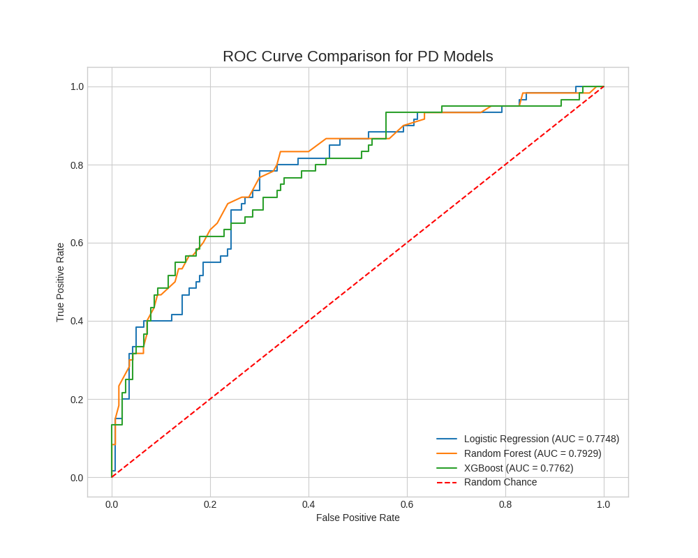
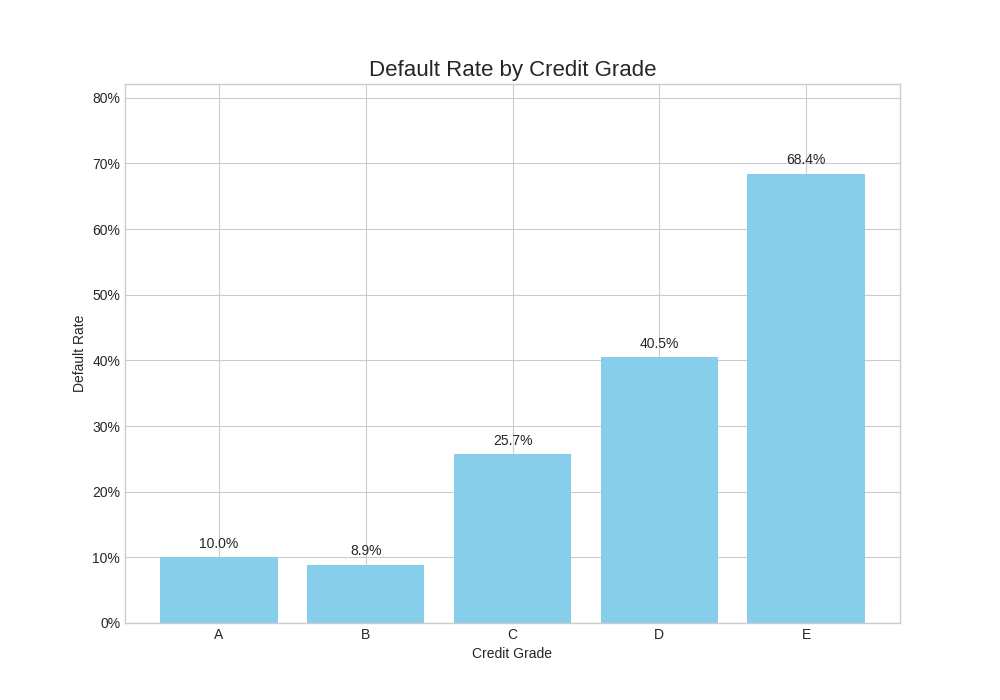

# Credit-Risk-PD-Model_LV1

An end-to-end framework for building and validating a Probability of Default (PD) model and a corresponding credit scorecard. Built from scratch in Python using the public German Credit dataset.

---

## Motivation

While predicting loan default is a classic machine learning problem, the real business value lies in translating a model's statistical output into a practical, interpretable, and robust tool for decision-making.

This project's goal is to demonstrate the full workflow:
1.  **Benchmarking multiple models** to select the most effective algorithm.
2.  **Developing a credit scorecard** that converts abstract default probabilities into a tangible credit score and rating system.
3.  **Critically analyzing the final scorecard's performance** to identify its strengths and limitations, mirroring a real-world model validation process.

---

## Methodology

### 1. Data Preprocessing
The raw dataset is loaded and cleaned. A binary target variable (`Default`) is created. All categorical features are numerically encoded, and all features are standardized using `StandardScaler` to prepare them for modeling.

### 2. Model Benchmarking
Three distinct models are trained and evaluated on a held-out test set to identify the most powerful algorithm for this dataset.
- **Logistic Regression**: A transparent, highly-interpretable industry baseline.
- **Random Forest**: An ensemble model known for its robustness and high performance.
- **XGBoost**: A gradient boosting model, often a top performer on tabular data.

Models are compared based on their **AUC (Area Under the ROC Curve)** and **KS (Kolmogorov-Smirnov)** statistics.

### 3. Scorecard Development
The best-performing model (Random Forest) is used to build the scorecard.
- **Probability-to-Score Conversion**: A linear mapping transforms the model's predicted default probabilities (0-1) into an intuitive credit score range (300-850).
- **Quantile-based Grading**: To ensure stable and meaningful risk segmentation, customers in the test set are assigned a grade (A, B, C, D, E) based on the **quantile of their score**. For example, the top 20% of scores are assigned Grade A.

### 4. Validation & Analysis
The final scorecard is validated by grouping the test-set customers by their assigned grade and calculating the actual default rate for each group. The expectation is a monotonic increase in default rate as the grade worsens (from A to E).

---

## Key Findings

### 1. Model Benchmarking Results
Random Forest showed a clear performance advantage over both the baseline and XGBoost.



| Model               | AUC     |
| ------------------- | ------- |
| **Random Forest**   | **0.793** |
| XGBoost             | 0.776   |
| Logistic Regression | 0.775   |

### 2. Credit Scorecard Performance
The final scorecard successfully segments the population into distinct risk tiers.



| Grade | Min_Score | Max_Score | Count | Default_Rate |
| ----- | --------- | --------- | ----- | ------------ |
| A     | 784       | 839       | 40    | 10.00%       |
| B     | 718       | 778       | 45    | 8.89%        |
| C     | 657       | 712       | 35    | 25.71%       |
| D     | 575       | 652       | 42    | 40.48%       |
| E     | 377       | 569       | 38    | 68.42%       |

**Analysis**: The scorecard shows a strong monotonic risk trend from Grade B to E. The anomaly in Grade A vs. B is likely due to statistical noise in the small test sample and suggests merging these two grades into a single "Prime" category for business implementation.

---

## Project Structure

```
Credit-Risk-PD-Model_LV1/
├── src/
│   ├── config.py
│   ├── processing.py
│   ├── scorecard.py
│   └── train.py
│
├── notebooks/
│   └── Credit-Risk-PD-Model_LV1.ipynb
│
├── outputs/                   
│   ├── 01_model_benchmark_roc_curves.png
│   └── 02_scorecard_grade_analysis.png
│
├── requirements.txt
└── README.md
```

---

## Data Sources

| Data | Source | Link |
|------|--------|------|
| German Credit Data | UCI Machine Learning Repository | [Link](https://archive.ics.uci.edu/ml/datasets/statlog+(german+credit+data)) |

---

## How to Run

1.  **Clone the repository:**
    ```bash
    # Replace YOUR_USERNAME with your actual GitHub username
    git clone https://github.com/YOUR_USERNAME/Credit-Risk-PD-Model_LV1.git
    cd Credit-Risk-PD-Model_LV1
    ```

2.  **Install dependencies:**
    ```bash
    pip install -r requirements.txt
    ```

3.  **Run via Scripts or Notebook:**
    *   **Option A: Run final scripts directly**
        ```bash
        # For model benchmarking
        python -m src.train
        # For scorecard generation
        python -m src.scorecard
        ```
    *   **Option B: Use the notebook**
        Open and run the cells in `notebooks/Credit_Risk_Analysis.ipynb` for a more interactive experience. This is also the easiest way to run on Google Colab.

---

## Limitations

- **Dataset Size**: The dataset contains only 1000 samples, which limits model stability and makes the scorecard sensitive to small fluctuations in the test set (as seen in the A/B grade anomaly).
- **Basic Feature Engineering**: The project uses simple numerical encoding. More advanced techniques like Weight of Evidence (WOE) were not implemented in this version.
- **No Hyperparameter Tuning**: All models were trained using their default parameters. Tuning could potentially yield further performance gains.

---

## Disclaimer

This project is for educational and research purposes only. It is not financial or investment advice.
